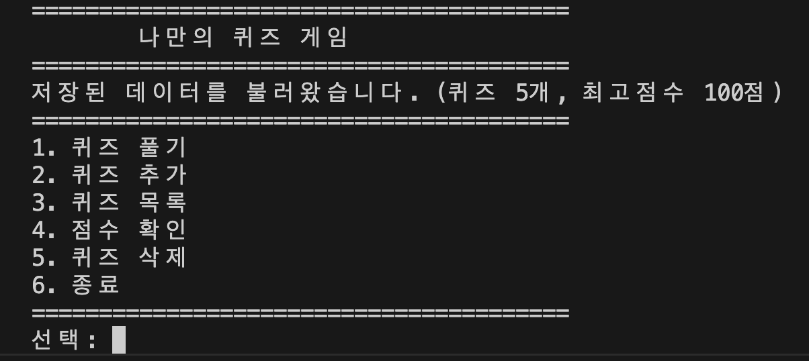

# 나만의 퀴즈 게임

## 프로젝트 개요

프로그래밍/IT 주제의 터미널 퀴즈 게임이다. Python으로 구현했으며, 퀴즈 풀기, 퀴즈 추가, 퀴즈 목록, 점수 확인, 퀴즈 삭제 기능을 제공한다. 프로그램을 종료해도 퀴즈 데이터와 점수가 `state.json` 파일에 자동 저장되어 다음 실행 시 그대로 유지된다.

## 퀴즈 주제 선정 이유

프로그래밍/IT는 본인에게 가장 익숙한 분야이기 때문에 선택했다. 익숙한 주제여야 문제와 선택지의 품질을 직접 판단할 수 있고, 퀴즈를 추가할 때도 자연스럽게 좋은 문제를 만들 수 있다.

## GitHub 저장소

- 저장소: https://github.com/nansu0425/E1-2.git
- 브랜치 기록: `feature/safe-exit` 브랜치에서 작업 후 `--no-ff` 병합으로 main에 통합
- 커밋 이력: `git log --oneline --graph`로 확인 가능

## 실행 방법

Python 3.10 이상이 필요하다. 외부 라이브러리는 사용하지 않는다.

```bash
python main.py
```

## 기능 목록

| 번호 | 기능 | 설명 |
|---|---|---|
| 1 | 퀴즈 풀기 | 원하는 문제 수를 선택하여 랜덤 순서로 풀 수 있다. 힌트 사용 시 점수가 절반만 인정된다. |
| 2 | 퀴즈 추가 | 문제, 선택지 4개, 정답 번호, 힌트(선택)를 입력하여 새 퀴즈를 등록한다. |
| 3 | 퀴즈 목록 | 등록된 모든 퀴즈를 번호와 함께 출력한다. |
| 4 | 점수 확인 | 최고 점수와 전체 게임 기록(날짜, 문제 수, 정답 수, 점수)을 확인한다. |
| 5 | 퀴즈 삭제 | 목록에서 퀴즈를 선택하여 삭제한다. |
| 6 | 종료 | 프로그램을 종료한다. |

## 실행 화면

| 화면 | 스크린샷 |
|---|---|
| 메뉴 |  |
| 퀴즈 풀기 |  |
| 퀴즈 추가 |  |
| 점수 확인 |  |
| 깃 기록 |  |
| 깃 클론 |  |
| 깃 풀 |  |
| 개발 환경 |  |

## 입력 오류 처리

모든 사용자 입력에 대해 검증을 수행하며, 유효하지 않은 입력 시 안내 메시지를 출력하고 재입력을 요청한다.

| 상황 | 처리 |
|---|---|
| 공백만 입력 | "문제를 입력해주세요." 등 안내 후 재입력 |
| 숫자가 아닌 문자 입력 | "잘못된 입력입니다. N-M 사이의 숫자를 입력하세요." 후 재입력 |
| 범위 밖 숫자 입력 | 동일한 안내 후 재입력 |
| 빈 Enter 입력 | 빈 입력으로 간주, 재입력 요청 (힌트 입력 제외) |
| Ctrl+C / Ctrl+D | 종료 메시지 출력 후 현재 상태를 저장하고 안전 종료 |
| state.json 손상 | 안내 메시지 출력 후 기본 데이터로 자동 복구 |

## 파일 구조

```
E1-2/
├── main.py          # 프로그램 진입점
├── quiz.py          # Quiz 클래스 및 기본 퀴즈 데이터
├── quiz_game.py     # QuizGame 클래스 (게임 로직 전체)
├── state.json       # 런타임 데이터 저장 (.gitignore 대상)
├── .gitignore       # Git 추적 제외 파일 목록
├── README.md        # 프로젝트 설명서
└── docs/
    ├── MISSION.md   # 미션 요구사항
    ├── ROADMAP.md   # 개발 로드맵
    └── screenshots/ # 실행 화면 스크린샷
```

## 기술 설명서

클래스 설계, 로직 분리, JSON 저장 방식, 브랜치 전략 등 기술적 결정에 대한 설명은 [docs/DESIGN.md](docs/DESIGN.md)를 참고한다.

## 데이터 파일 설명 (`state.json`)

게임의 모든 상태를 저장하는 JSON 파일이다. 프로젝트 루트에 위치하며 UTF-8 인코딩으로 저장된다. `.gitignore`에 포함되어 Git으로 추적하지 않는다.

- 첫 실행 시 파일이 없으면 기본 퀴즈 5개로 자동 생성된다.
- 파일이 손상된 경우 안내 메시지를 출력하고 기본 데이터로 자동 복구한다.

### 구조

```json
{
    "quizzes": [
        {
            "question": "문제 텍스트",
            "choices": ["선택지1", "선택지2", "선택지3", "선택지4"],
            "answer": 1,
            "hint": "힌트 텍스트"
        }
    ],
    "best_score": {
        "score": 100,
        "correct": 3,
        "total": 3
    },
    "has_played": true,
    "history": [
        {
            "date": "2026-04-08 11:30",
            "total": 5,
            "correct": 3,
            "score": 60
        }
    ]
}
```

| 필드 | 타입 | 설명 |
|---|---|---|
| `quizzes` | 배열 | 등록된 퀴즈 목록. 각 항목은 문제, 선택지 4개, 정답 번호(1-4), 힌트를 포함한다. |
| `best_score` | 객체 | 최고 점수 기록. 점수, 정답 수, 총 문제 수를 저장한다. |
| `has_played` | 불린 | 한 번이라도 퀴즈를 풀었는지 여부. |
| `history` | 배열 | 모든 게임 기록. 각 항목은 날짜, 총 문제 수, 정답 수, 점수를 포함한다. |
